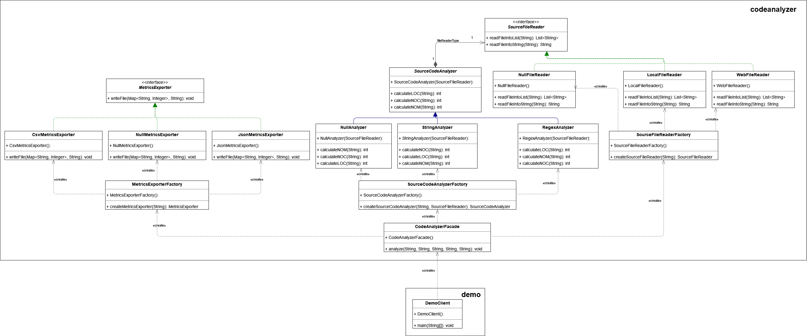

## Source code analyzer

This is a Java application that processes the source code of a file and calculates
the following metrics for each method of the respective file: LOC (lines of code), NOM (number of methods), and NOC (number of classes).

### Package Structure

The package structure of the module is the following:

1. codeanalyzer - Contains the classes that read and analyze a file to export the metrics
2. demo - Which contains a demo class that uses the codeanalyzer package to export the metrics of a file

## How to run the application

1. Build the executable Java application with:
	mvn package jacoco:report

2. Run the executable by executing
	java –jar “jar-with-dependencies” arg0 arg1 arg2 arg3 arg4
were args translate to:
	arg0 = “JavaSourceCodeInputFile” (e.g., src/test/resources/TestClass.java)
	arg1 = “sourceCodeAnalyzerType” [regex|strcomp]
	arg2 = “SourceCodeLocationType” [local|web]
	arg3 = “OutputFilePath” (e.g., ../output_metrics_file)
	arg4 = “OutputFileType” [csv|json]
example:
	java –jar ./target/sourcecodeanalyzer-0.0.1-SNAPSHOT-jar-with-dependencies.jar ./src/test/resources/TestClass.java regex local metrics_results csv

## Solution Overview

The main design patterns used in this project are the following:

1. Factory Pattern - The factory pattern is used to create the correct instance of the SourceCodeAnalyzer class based on the user's input.
2. Strategy Pattern - The strategy pattern is used to implement the different types of source code analyzers (regex and strcomp) and the different types of source code locations (local and web).
3. Facade Pattern - The facade pattern is used to hide the complexity of the code analyzer and provide a simple interface for the user to use.
4. Null Object Pattern - The null object pattern is used to provide a default behavior for the code analyzer when the user does not provide a valid input.

A combination of the above patterns is mostly used in my solution. The reasoning of the changes is the following:

### MetricsExporter.java

The MetricsExporter class was changed following the **Factory**, **Strategy** and **Null object** patterns. 
For this reason the `MetricsExporter` class was converted to an interface and 3 classes were created to implement it:
`JsonMetricsExporter`, `CsvMetricsExporter` and `NullMetricsExporter`. The `JsonMetricsExporter` and
`CsvMetricsExporter` classes are used to export the  metrics to a json and csv file respectively, and so they
contain different implementations of `writeFile` method. The `NullExporter` class is used when the user does not
provide a valid input for the output file type (**Null object** pattern). The `MetricsExporterFactory` class was
created to implement the **Factory** pattern. The factory pattern is used to create the correct instance of the
`MetricsExporter` class based on the user's input.

**Benefits of this approach:**
* The code is more extensible. If we want to add a new type of output file we can just create a new class that
implements the `MetricsExporter` interface and add it to the `MetricsExporterFactory` class.
* Single responsibility principle. Each class has a single responsibility (Strategy pattern).
* Separation of concerns. The `MetricsExporterFactory` class is responsible for creating the correct instance of
the `MetricsExporter` class based on the user's input (Factory pattern). The `MetricsExporter` classes are
responsible for exporting the metrics to the correct file type (Strategy pattern).
* Null cases are handled by the `NullMetricsExporter` class and not by the clients (Null object pattern).

**Drawbacks of this approach:**
* Hidden errors due to the **Null object** pattern.

### SourceFileReader.java

The SourceFileReader class was again changed following the **Factory**, **Strategy** and **Null object** patterns.
For this reason the `SourceFileReader` class was converted to an interface and 3 classes were created to implement it:
`LocalFileReader`, `WebFileReader` and `NullFileReader`. The `LocalFileReader` and `WebFileReader` classes 
are used to read a file from the local file system and from the web respectively, and so they contain
different implementations of `readFileIntoList` and `readFileIntoString` methods. The `NullFileReader`
class is used when the user does not provide a valid input for the source code location (**Null object** pattern).
The `SourceFileReaderFactory` class was created to implement the **Factory** pattern. The factory pattern is used
to create the correct instance of the `SourceFileReader` class based on the user's input.

**Benefits of this approach:**
* It is easy to add a new type of source code location. We can just create a new class that implements the
`SourceFileReader` interface and add it to the `SourceFileReaderFactory` class.
* Single responsibility principle. Each class has a single responsibility (Strategy pattern).
* Null cases are easier to handle by the `NullFileReader` class and not by the clients (Null object pattern).

**Drawbacks of this approach:**
* Hidden errors due to the **Null object** pattern.

### SourceCodeAnalyzer.java

The SourceCodeAnalyzer class was changed following the **Factory** and **Null object** patterns. This class
also follows the **Bridge** pattern. For this reason the `SourceCodeAnalyzer` class was converted to an abstract
class and 2 classes were created to extend it: `RegexSourceCodeAnalyzer` and `StrcompSourceCodeAnalyzer`. These 2
classes are used to implement the different types of source code analyzers (regex and strcomp) and so they contain
different implementations of `calculateLOC`, `calculateNOM` and `calculateNOC` methods. The `NullAnalyzer` class
is used when the user does not provide a valid input for the source code analyzer type (**Null object** pattern).
The `SourceCodeAnalyzerFactory` class implements the **Factory** pattern. The factory pattern is used
to create the correct instance of the `SourceCodeAnalyzer` class based on the user's input. The **Bridge** pattern
is used to separate the `SourceCodeAnalyzer` class from the `SourceFileReader` class. The `SourceCodeAnalyzer`
class contains a `SourceFileReader` object which is used to read the source code file.

**Benefits of this approach:**
* It is easy to add a new type of source code analyzer. We can just create a new class that extends the
`SourceCodeAnalyzer` abstract class and add it to the `SourceCodeAnalyzerFactory` class.
* Null cases are easier to handle.
* `SourceCodeAnalyzer` and `SourceFileReader` are independent.

**Drawbacks of this approach:**
* Hidden errors due to the **Null object** pattern.
* The `SourceCodeAnalyzer` and `SourceFileReader` classes are still coupled to an extent.

### CodeAnalyzerFacade.java

The CodeAnalyzerFacade class implements the **Facade** pattern. The facade pattern is used to hide the
complexity of the code analyzer and provide a simple interface for the user to use. The `analyze` method
of the `CodeAnalyzerFacade` class is used to implement all the functionality which was previously implemented
one by one from the client.

**Benefits of this approach:**
* The client does not need to know the details of the code analyzer.
* simpler interface for the client.

## UML Diagram

You can also find the diagram in .svg format [here](class_diagram.svg).
